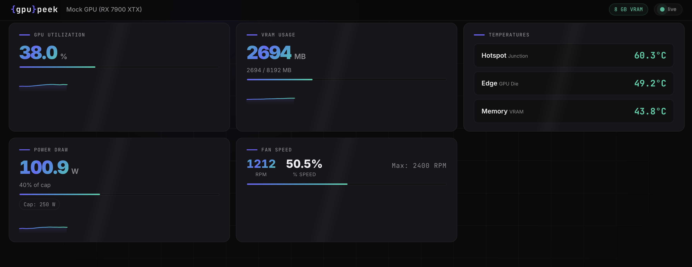

# gpupeek

A sleek, real-time GPU monitoring and control dashboard served as a local web page. Built in Rust with a WebSocket backend and a dark-themed frontend.

> **Linux only** — gpupeek relies on Linux kernel interfaces (sysfs) for GPU data and control. macOS/Windows get mock data only.



## Features

### Monitoring (all GPUs)
- **Real-time metrics** — GPU utilization, VRAM usage, temperatures (edge/hotspot/memory), power draw, clocks, fan speed
- **WebSocket streaming** — 1-second updates with sparkline history (60 data points)
- **Auto-detection** — NVIDIA, AMD, or Intel GPUs; falls back to mock data if none found

### Control (AMD only)
- **Fan control** — Auto, Manual (fixed %), or custom temperature-based Curve
- **Fan curve editor** — Interactive SVG graph: click to add points, drag to move, right-click to remove
- **Power cap** — Adjust GPU power limit with min/max bounds and percentage display
- **Voltage offset** — VDDGFX offset in mV (undervolting/overvolting)
- **Settings persistence** — All settings auto-save and re-apply on startup/reboot

> The Control tab is automatically hidden for NVIDIA and Intel users since those backends don't expose control APIs through NVML/sysfs.

## Supported GPUs

| Vendor | Monitoring | Control | Method |
|--------|-----------|---------|--------|
| AMD | ✓ | ✓ | sysfs (`/sys/class/drm/`) |
| NVIDIA | ✓ | ✗ | NVML (dynamic loading) |
| Intel | ✓ | ✗ | sysfs hwmon |
| None | Mock data | Mock simulation | — |

## Prerequisites

### Rust toolchain

```sh
curl --proto '=https' --tlsv1.2 -sSf https://sh.rustup.rs | sh
```

Minimum supported Rust version: **1.85** (edition 2024)

### GPU-specific requirements

**NVIDIA:**
- Proprietary driver installed (provides `libnvidia-ml.so`)
- `nvidia-smi` should work

**AMD (monitoring):**
- No extra packages — reads directly from sysfs
- Requires read access to `/sys/class/drm/card*/device/` files

**AMD (control):**
- Requires **write access** to sysfs files (run as root or configure permissions)
- For voltage offset: `amdgpu.ppfeaturemask=0xffffffff` kernel parameter required
- See [Permissions](#permissions) section below

**Intel:**
- No extra packages — reads from sysfs hwmon
- Limited metrics (typically temperature and power only)

## Building

```sh
git clone <repo-url> && cd gpupeek
cargo build --release
```

The binary is at `target/release/gpupeek`.

### Build without NVIDIA support

```sh
cargo build --release --no-default-features
```

### Feature flags

| Feature | Default | Description |
|---------|---------|-------------|
| `nvidia` | ✓ | NVIDIA GPU support via NVML |

AMD and Intel support are always compiled on Linux (zero extra dependencies).

## Running

```sh
# From the project directory
cargo run --release

# Or run the binary directly (must have access to static/ folder)
./target/release/gpupeek
```

Opens **http://localhost:3333** in your browser automatically.

### Command-line options

| Flag | Description |
|------|-------------|
| `--daemon` / `-d` | Run without opening browser (for systemd/background use) |

### Environment variables

| Variable | Description |
|----------|-------------|
| `GPUPEEK_CONFIG` | Override config file path (default: `~/.config/gpupeek/config.json`) |

## Settings Persistence

gpupeek automatically saves your control settings (fan mode, curve, power cap, voltage offset) to a JSON config file. On startup, saved settings are re-applied to the GPU.

**Config location:** `~/.config/gpupeek/config.json` (or `$XDG_CONFIG_HOME/gpupeek/config.json`)

The config is tied to the specific GPU by its sysfs path. If you swap hardware, gpupeek will skip applying the old config and start fresh.

### Example config

```json
{
  "version": 1,
  "gpu_id": "/sys/class/drm/card1/device",
  "fan": {
    "mode": "curve",
    "points": [
      { "temp_c": 30, "speed_pct": 25 },
      { "temp_c": 50, "speed_pct": 35 },
      { "temp_c": 70, "speed_pct": 70 },
      { "temp_c": 85, "speed_pct": 100 }
    ]
  },
  "power_cap_watts": 250.0,
  "voltage_offset_mv": -50
}
```

## Running as a Systemd Service

To make settings persist across reboots, run gpupeek as a system service:

```sh
# Install the binary
sudo cp target/release/gpupeek /usr/local/bin/
sudo cp -r static /usr/local/share/gpupeek/

# Install and enable the service
sudo cp gpupeek.service /etc/systemd/system/
sudo systemctl daemon-reload
sudo systemctl enable --now gpupeek
```

The service runs with `--daemon` (no browser popup) and restarts on failure. Check logs with:

```sh
journalctl -u gpupeek -f
```

> **Note:** The service runs as root by default, which is required for GPU control via sysfs. The dashboard only binds to `127.0.0.1:3333` (localhost only) for security.

## Permissions

GPU control requires write access to sysfs files. Options:

### Option 1: Run as root (simplest)
```sh
sudo gpupeek --daemon
```

### Option 2: Udev rules (recommended for non-root)
Create `/etc/udev/rules.d/99-gpupeek.rules`:
```
# AMD GPU fan control
SUBSYSTEM=="hwmon", DRIVERS=="amdgpu", RUN+="/bin/chmod 0666 %S%p/pwm1 %S%p/pwm1_enable %S%p/power1_cap"
# AMD voltage offset
SUBSYSTEM=="drm", DRIVERS=="amdgpu", RUN+="/bin/chmod 0666 %S%p/device/pp_od_clk_voltage"
```
Then reload: `sudo udevadm control --reload-rules && sudo udevadm trigger`

### Voltage offset (undervolting)

Requires the `amdgpu.ppfeaturemask` kernel parameter. Add to your bootloader config:

```
amdgpu.ppfeaturemask=0xffffffff
```

For GRUB, edit `/etc/default/grub`:
```
GRUB_CMDLINE_LINUX_DEFAULT="... amdgpu.ppfeaturemask=0xffffffff"
```
Then `sudo update-grub` and reboot.

## Project Structure

```
gpupeek/
├── Cargo.toml          # Dependencies and feature flags
├── gpupeek.service     # Systemd service unit file
├── src/
│   ├── main.rs         # Server, WebSocket, REST API, config apply
│   ├── gpu_data.rs     # Shared types (GpuSnapshot, DataSource trait)
│   ├── gpu_control.rs  # Control trait, FanMode, CurvePoint, ControlInfo
│   ├── config.rs       # Settings persistence (load/save JSON)
│   ├── mock_data.rs    # Realistic mock data generator
│   ├── nvidia.rs       # NVIDIA backend (NVML)
│   ├── amd.rs          # AMD backend (sysfs monitoring + control)
│   └── intel.rs        # Intel backend (sysfs, Linux only)
└── static/
    └── index.html      # Dashboard + Control UI (HTML + CSS + JS)
```

## API Endpoints

| Method | Path | Description |
|--------|------|-------------|
| GET | `/ws` | WebSocket — streams `GpuSnapshot` JSON every second |
| GET | `/health` | Health check |
| GET | `/api/control` | Get current control state and capabilities |
| POST | `/api/fan/mode` | Set fan mode (`{"mode": "auto\|manual\|curve"}`) |
| POST | `/api/fan/speed` | Set manual fan speed (`{"speed_pct": 70}`) |
| POST | `/api/fan/curve` | Set fan curve (`{"points": [...]}`) |
| POST | `/api/power-cap` | Set power cap (`{"watts": 250}`) |
| POST | `/api/voltage-offset` | Set voltage offset (`{"mv": -50}`) |

## Troubleshooting

**"No supported GPU found — using mock data" on Linux:**
- NVIDIA: ensure the proprietary driver is installed (`nvidia-smi` should work)
- AMD: check that `/sys/class/drm/card0/device/vendor` contains `0x1002`
- Permissions: try running with `sudo` or add your user to the `video` group

**Control tab not showing (AMD):**
- Fan/power files aren't writable — run as root or set up udev rules
- Voltage offset needs `amdgpu.ppfeaturemask` kernel parameter

**Settings not persisting across reboot:**
- Ensure gpupeek runs on startup (systemd service or autostart)
- Check config file exists: `cat ~/.config/gpupeek/config.json`

**Dashboard shows but no data updates:**
- Check browser console for WebSocket errors
- Ensure nothing else is using port 3333

## License

MIT

